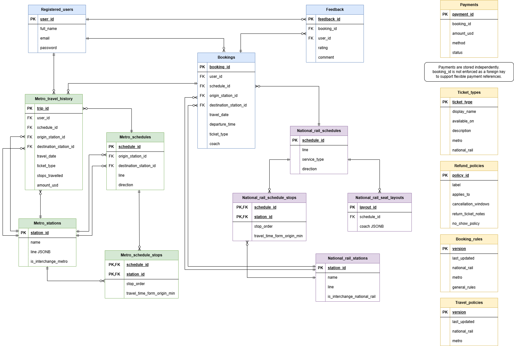

## Section 1 — Entity-Relationship Diagram

### 1.1 ERD Diagram



### 1.2 Entity and Attribute Details

| Entity Name                    | Primary Key (PK)              | Foreign Keys (FK)                                                       | Representative Data Fields                               |
| ------------------------------ | ----------------------------- | ----------------------------------------------------------------------- | -------------------------------------------------------- |
| `registered_users`             | `user_id`                     | None                                                                    | `full_name`, `email`, `phone`, `is_active`               |
| `metro_stations`               | `station_id`                  | None                                                                    | `name`, `lines`, `is_interchange_national_rail`          |
| `national_rail_stations`       | `station_id`                  | None                                                                    | `name`, `lines`, `is_interchange_metro`                  |
| `metro_schedules`              | `schedule_id`                 | `origin_station_id`, `destination_station_id`                           | `line`, `direction`, `first_train_time`, `frequency_min` |
| `metro_schedule_stops`         | (`schedule_id`, `station_id`) | `schedule_id`, `station_id`                                             | `stop_order`, `travel_time_from_origin_min`              |
| `national_rail_schedules`      | `schedule_id`                 | `origin_station_id`, `destination_station_id`                           | `line`, `service_type`, `fare_classes`, `frequency_min`  |
| `national_rail_schedule_stops` | (`schedule_id`, `station_id`) | `schedule_id`, `station_id`                                             | `stop_order`, `travel_time_from_origin_min`              |
| `national_rail_seat_layouts`   | `layout_id`                   | `schedule_id`                                                           | `coaches`                                                |
| `bookings`                     | `booking_id`                  | `user_id`, `schedule_id`, `origin_station_id`, `destination_station_id` | `travel_date`, `fare_class`, `seat_id`, `status`         |
| `metro_travel_history`         | `trip_id`                     | `user_id`, `schedule_id`, `origin_station_id`, `destination_station_id` | `travel_date`, `ticket_type`, `amount_usd`, `status`     |
| `payments`                     | `payment_id`                  | None                                                                    | `booking_id`, `amount_usd`, `method`, `status`           |
| `feedback`                     | `feedback_id`                 | `booking_id`, `user_id`                                                 | `rating`, `comment`, `submitted_at`                      |
| `policy_documents`             | `id`                          | None                                                                    | `title`, `category`, `content`, `embedding`              |

---

## Section 2 — Normalisation Justification

### 2.1 2NF / 3NF Design Decision

One important normalisation decision was separating station stop information from schedule tables into dedicated junction tables: `metro_schedule_stops` and `national_rail_schedule_stops`.

Each schedule may contain many stations, and each station may appear in many schedules. Therefore, the relationship between schedules and stations is a many-to-many relationship. Instead of storing station lists directly inside schedule records, the design uses separate stop tables with composite keys consisting of `schedule_id` and `station_id`.

This design satisfies Second Normal Form (2NF) because attributes such as `stop_order` and `travel_time_from_origin_min` depend on the entire composite key rather than only part of it. For example, the stop order of a station only has meaning within a particular schedule.

The design also satisfies Third Normal Form (3NF). Station attributes such as station name, interchange information, and location details are stored in the station tables rather than repeated inside every stop record. This removes transitive dependencies and reduces data redundancy. As a result, station information only needs to be updated in one location.

### 2.2 Deliberate De-normalisation Trade-off

TransitFlow intentionally uses JSONB for several semi-structured attributes, including seat layouts, operating days, fare classes, and metro line information.

A representative example is `national_rail_seat_layouts.coaches`, which stores nested coach and seat information as JSONB. Fully normalising this structure would require additional tables for coaches, seat rows, and individual seats. While this would improve relational purity, it would significantly increase schema complexity and query overhead.

Because seat layouts are usually retrieved as complete structures rather than queried at the individual seat level, storing them as JSONB provides a simpler implementation and more direct mapping from the supplied mock data. This represents a deliberate de-normalisation trade-off in which flexibility and ease of integration are prioritised over strict normalisation.

### 2.3 Password Hashing Strategy

TransitFlow stores user passwords using PBKDF2-HMAC-SHA256 rather than plain-text passwords.

PBKDF2 is a password hashing algorithm that repeatedly applies a cryptographic hash function to increase computational cost. In our implementation, PBKDF2-HMAC-SHA256 is configured with 200,000 iterations. This significantly increases the time required for brute-force attacks compared with general-purpose hash functions such as MD5 or SHA-1.

MD5 and SHA-1 are designed to be computationally fast and are therefore unsuitable for password storage. Their speed allows attackers to perform large numbers of password guesses using modern GPUs. PBKDF2 introduces key stretching through repeated hashing operations, making password cracking substantially more expensive.

A unique random salt is generated for every user password before hashing. The salt is stored together with the resulting hash and ensures that identical passwords produce different stored values. This prevents rainbow-table attacks and protects against large-scale precomputed password cracking techniques.

The system also includes password verification logic that compares user login attempts against the stored PBKDF2 hash. Newly registered users and password resets always use the PBKDF2 hashing process before storage in the database.

---

## Section 3 — Graph Database Design Rationale

### 3.1 Graph Model: Nodes, Relationships, and Properties

In the TransitFlow system, the transportation network is modeled as a property graph in Neo4j.

**Nodes:**

The primary node type is `Station`, which is further differentiated using labels `:Metro` and `:Rail` to represent city metro and national rail systems. Each station represents a real-world physical stop in the transportation network.

**Relationships:**

Two main relationship types are used:

* `CONNECTED_TO`: Represents direct travel connections between stations within the same transport network.
* `INTERCHANGE_TO`: Represents transfer connections between metro and rail systems at interchange stations.

These relationships encode both connectivity and movement direction in the network.

**Properties:**

Key properties include:

* `station_id`: Unique identifier for each station
* `name`: Human-readable station name
* `travel_time_min`: Weight used for routing algorithms (Dijkstra shortest path)
* `transfer_time_min`: Cost of interchanging between networks
* `line_id`: Identifies which line the station or edge belongs to

This design allows routing algorithms to operate directly on weighted edges without additional joins or transformations.

### 3.2 Why a Graph Database is Used Instead of a Relational Database

A graph database is more suitable than a relational database for transit routing because transportation networks are inherently graph-structured.

In a relational database, computing shortest paths or multi-hop routing requires recursive Common Table Expressions (CTEs) and repeated joins across adjacency tables. As the depth of traversal increases, query complexity and computational cost grow significantly.

In contrast, Neo4j supports native graph traversal algorithms such as Dijkstra’s algorithm through APOC procedures. This allows shortest path computation to be performed directly on relationships with weighted edges.

For example:

* Shortest route computation is handled using `apoc.algo.dijkstra`
* Delay ripple analysis is implemented using variable-length path traversal (`1..N`)
* Interchange routing is naturally expressed through heterogeneous relationships (`CONNECTED_TO` and `INTERCHANGE_TO`)

Therefore, graph traversal provides both better performance and significantly simpler query logic compared to recursive SQL approaches.

### 3.3 Query Types Enabled by the Graph Structure

The graph design supports multiple routing query types:

#### (1) Shortest Path Routing

The system computes fastest routes using Dijkstra’s algorithm over `travel_time_min`. Because travel time is stored directly as relationship weights, the algorithm can traverse the graph without preprocessing.

#### (2) Interchange Routing

The presence of `INTERCHANGE_TO` relationships enables seamless traversal between metro and rail networks. This allows the system to treat both networks as a unified graph while preserving transfer costs.

#### (3) Delay Ripple Analysis

Using variable-length traversal (`1..N hops`), the system can identify all stations affected by a disruption. This would be difficult to express efficiently in SQL due to recursive dependency expansion.

These query types are directly supported by the graph structure, eliminating the need for complex join logic.

### 3.4 Node Identity Design

Each station is uniquely identified using the `station_id` property.

This choice ensures:

* Uniqueness across metro and rail systems
* Stability even if station names change
* Efficient matching during graph construction and query execution

Using `station_id` as the primary identifier ensures consistency across both node creation and relationship mapping.

---

## Section 4 — Vector / RAG Design

### 4.1 Embedded Policy Documents

TransitFlow uses a vector database to support policy-related questions. The embedded content consists of policy documents loaded from the project’s mock data files, including `refund_policy.json`, `ticket_types.json`, `booking_rules.json`, and `travel_policies.json`.

These documents cover refund rules, delay compensation, ticket type descriptions, booking rules, luggage rules, bicycle rules, and general travel policies. They are embedded because users often ask policy questions using wording that does not exactly match the stored policy text.

For example, a user may ask, “Can I get money back if my train is delayed?”, while the stored document may describe this as “delay compensation” or “30–59 minutes delay refund.” Vector search allows the assistant to retrieve semantically related documents even when exact keywords differ.

### 4.2 Why Cosine Similarity Is Used

Cosine similarity is appropriate for policy retrieval because it compares the direction of two embedding vectors rather than their absolute magnitude. In text embedding space, the direction of a vector represents semantic meaning. Therefore, two texts with similar meanings should point in a similar direction, even if their wording or length is different.

This is useful for policy search because policy documents may be longer than user questions. A raw distance metric may be affected by vector magnitude, while cosine similarity focuses on directional similarity. This makes it better suited for retrieving documents that are semantically close to the user’s question.

### 4.3 RAG Pipeline Description

The Retrieval-Augmented Generation pipeline works as follows:

1. **Query embedding**

   When the user asks a policy question, such as “Can I get compensation for a delayed train?”, the system sends the user query to the embedding model and converts it into a vector.

2. **Similarity search**

   The query vector is compared against the stored vectors in the `policy_documents` table using pgvector similarity search.

3. **Retrieved documents**

   The most relevant policy documents are retrieved. Each retrieved document includes information such as title, category, content, and similarity score.

4. **LLM prompt construction**

   The retrieved policy content is inserted into the LLM prompt as grounded context from the TransitFlow database.

5. **Answer generation**

   The LLM generates the final answer using the retrieved policy documents as the source of truth. This reduces hallucination because the model does not need to answer policy questions from memory alone.

### 4.4 Embedding Dimension and Provider Switching

Our implementation uses Ollama with the `nomic-embed-text` embedding model. This produces 768-dimensional embeddings, so the `policy_documents.embedding` column is designed to store 768-dimensional vectors.

If the embedding provider is switched after seeding, the existing vector data cannot be reused directly. For example, Gemini text embeddings may use 3072 dimensions. A 3072-dimensional query vector cannot be compared with the 768-dimensional vectors already stored in `policy_documents.embedding`. In practice, this means similarity search would fail or become unusable because pgvector requires vectors being compared to have the same dimension.

Therefore, switching from Ollama to Gemini after seeding would require clearing the existing `policy_documents` vector data, changing the embedding column dimension in the schema if needed, and rerunning `seed_vectors.py` with the new provider. Otherwise, the RAG pipeline would not be able to retrieve policy documents correctly.

### 4.5 Vector Search Testing Evidence

After installing the Ollama embedding model `nomic-embed-text`, we ran:

```bash
python3 skeleton/seed_vectors.py
```

The script embedded 13 policy documents using Ollama and stored them in the PostgreSQL `policy_documents` table.

We verified the vector search with two policy questions.

First, we tested the query:

```text
can I get a refund if my train is delayed?
```

The top retrieved document was **“Delay Compensation – All Networks”** with a similarity score of approximately **0.727**. This result is appropriate because the retrieved document contains compensation rules for 30–59 minute, 60–119 minute, and 120+ minute delays.

Second, we tested the query:

```text
Can I bring a bicycle on the train?
```

The top retrieved documents were **“Travel Policies — National Rail”** with a similarity score of approximately **0.731**, followed by **“Travel Policies — Metro”** with a similarity score of approximately **0.687**. This result is also appropriate because bicycle carriage is a travel-conduct policy rather than a fare or booking rule.

These tests confirm that the RAG pipeline can retrieve semantically relevant policy documents even when the user’s wording does not exactly match the stored policy titles or categories.

---

## Section 5 — AI Tool Usage Evidence

### Example 1 — Relational Schema and Normalisation Review

**Context:**

During the PostgreSQL schema design stage, the team needed to confirm whether the relational schema could correctly support users, metro stations, national rail stations, schedules, schedule stops, seat layouts, bookings, payments, and policy documents. We also needed to explain the normalisation decisions in database terminology.

**Prompt:**

“Given our TransitFlow PostgreSQL schema, help us review whether the design supports users, schedules, station stop ordering, bookings, payments, and seat layouts. Also help us explain one 3NF normalisation decision using functional dependency terminology.”

**Outcome:**

The AI helped us clarify why schedule stops should be stored in separate stop tables instead of as an array inside the schedule table. The key idea was that stop order depends on the combination of `schedule_id` and `station_id`, so storing schedule-stop records in a junction-style table avoids repeating groups and supports a clearer 3NF design. We then checked the explanation against our actual schema and used it to support the normalisation section of the design document.

---

### Example 2 — Relational Query Function Implementation

**Context:**

I was responsible for implementing and testing the relational query functions in `databases/relational/queries.py`. These functions included national rail availability, metro schedules, fare calculation, available seats, user profile, user bookings, payment information, booking, cancellation, and authentication.

**Prompt:**

“Given this `schema.sql` and the required function signatures in `queries.py`, help me identify which functions are incomplete and suggest safe implementations using `_connect()`, `RealDictCursor`, and `%s` SQL placeholders.”

**Outcome:**

The AI helped identify incomplete areas in `queries.py`, especially booking cancellation and authentication functions. I used the suggestions as a starting point, then manually checked table names, column names, return formats, and transaction logic against the actual schema. After implementation, I tested the functions directly with Python scripts. The tests confirmed that fare calculation, seat availability, user bookings, payment lookup, booking, cancellation, registration, login, and password update worked correctly.

---

### Example 3 — Debugging AI-Assisted Code That Still Contained Old TODO Blocks

**Context:**

After adding AI-assisted implementations into `queries.py`, the file still contained `NotImplementedError` blocks. This meant that although new code had been added, some old incomplete function bodies were still present.

**Prompt:**

“`grep -n "NotImplementedError" databases/relational/queries.py` still shows several lines after I pasted the new implementations. Help me understand why the old blocks remain and what I should delete.”

**Outcome:**

The AI helped identify that the new implementations had been added without fully removing the old placeholder blocks and duplicate function definitions. I used `grep`, VS Code line navigation, and `python3 -m py_compile` to locate and verify the problem. After removing the stale `NotImplementedError` sections, the file compiled successfully and `grep` no longer found any remaining incomplete blocks. This was a correction case: the AI-assisted code was not sufficient by itself, so I had to verify and clean the actual file manually.

---

### Example 4 — Vector / RAG Testing with Ollama and pgvector

**Context:**

I tested the Vector/RAG component using Ollama. After installing `nomic-embed-text`, I ran `python3 skeleton/seed_vectors.py` to embed policy documents into the PostgreSQL `policy_documents` table. I then tested whether semantic search could retrieve the correct policy documents.

**Prompt:**

“Help me test whether the RAG pipeline is working. I want to embed a query such as ‘can I get a refund if my train is delayed?’ and check whether `query_policy_vector_search()` retrieves the correct policy document.”

**Outcome:**

The AI helped design a direct vector search test using `llm.embed()` and `query_policy_vector_search()`. The query “can I get a refund if my train is delayed?” retrieved **Delay Compensation – All Networks** as the top result, with a similarity score of approximately 0.727. A second query, “Can I bring a bicycle on the train?”, retrieved **Travel Policies — National Rail** as the top result, with a similarity score of approximately 0.731. These results showed that the RAG component could retrieve policy documents by meaning, not only by exact keywords.

---

### Example 5 — Ollama UI Testing and Tool-Routing Limitations

**Context:**

We tested the Gradio UI using Ollama with the debug panel enabled. The goal was to verify whether the assistant could select the correct database tools and whether the final answers matched the raw database results.

**Prompt:**

“Use the UI debug panel to test five representative questions: train availability, available seats, delay compensation, fastest route, and national rail fare. Help me distinguish whether an error comes from the database function, the tool selection, or the final Ollama-generated answer.”

**Outcome:**

The AI helped interpret the debug output. Several tool results were correct: `check_national_rail_availability` returned NR_SCH01 and NR_SCH05 for NR01 to NR05, `get_available_seats` returned 11 available standard seats and correctly excluded B05, `search_policy` retrieved the delay compensation policy, and `find_route` returned a valid route from MS01 to MS14.

However, the local Ollama model did not always produce reliable final answers. For the seat query, the raw tool result showed 11 available seats, but the final answer incorrectly mentioned only B01. For the route query, the graph tool returned the correct path through University, but the final answer miscopied one station. For the fare query, Ollama selected `check_national_rail_availability` instead of `get_national_rail_fare`. We confirmed through direct function testing that `query_national_rail_fare("NR_SCH01", "standard", "4")` returned the correct fare of 8.5 after adding defensive conversion for string stop counts. Since the instructor said not to modify `agent.py`, we treated these as small-model tool-routing or response-generation limitations rather than database query errors.

---

## Section 6 — Reflection and Design Trade-offs

### 6.1 Architectural Design Decisions

**Use of Explicit External Identifiers**

We chose meaningful VARCHAR-based identifiers instead of auto-incrementing SERIAL keys. Since TransitFlow integrates predefined metro and rail datasets, preserving external IDs simplified data import and ensured consistency across different transport systems.

**Use of JSONB for Semi-Structured Data**

Seat layouts, fare classes, and operating schedules were stored as JSONB instead of fully normalised tables. This reduced schema complexity and allowed direct reuse of the provided mock data while maintaining acceptable query performance.

**Flexible Payment Design**

The payments table was designed to support both metro and national rail transactions. To achieve this flexibility, strict foreign-key enforcement was relaxed and validation was handled at the application level.

**Soft Delete Strategy**

Instead of permanently deleting booking records, we used status fields such as `confirmed`, `cancelled`, and `completed`. This preserves transaction history and supports auditing and future analytics.

### 6.2 Transition to Production

**Connection Pooling**

For large-scale deployment, a connection pooler such as PgBouncer would be required to efficiently manage thousands of concurrent database connections.

**Database Migration Management**

In production, schema updates should be handled through migration tools such as Flyway or Prisma Migrate rather than recreating databases. This minimises downtime and supports safe schema evolution.
